# RCS增强短信

中国移动的RCS功能：RCS增强短信

* RCS增强短信
  * 和飞信 vs 融合通信（RCS） vs RCS增强短信终端
    * 和飞信
      * 是什么：中国移动的产品名称
        * 遵循GSMA的新一代通讯技术标准建设
      * 简称：融合通信（RCS）
      * 有多种产品形态
        * APP端
        * pc端
        * RCS增强短信终端
  * 特点
    * 无需下载app, 即可通过手机短信入口发送富媒体消息
      * 举例
        * 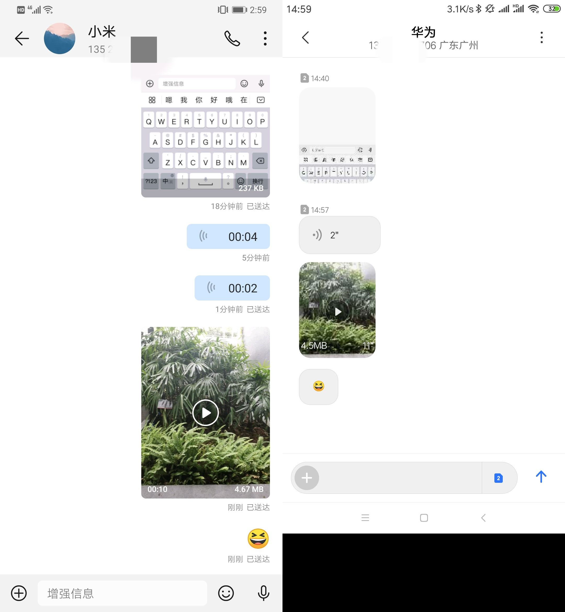
    * 无需添加好友，知道接收方手机号码即可发送
      * 接收方
        * 特点：没有手机以及运营商限制
          * 跟传统短信一样
        * RCS增强短信功能
          * 已开通
            * 消息接收模式为消息
          * 未开通
            * 转为普通短信接收
              * 内部细节
                * 你发送的媒体信息会转存到移动的云服务中，对方会收到一条带有链接的普通短信
                * 对方点开链接，就能在网页上看到发送过来的内容
              * 举例
                * 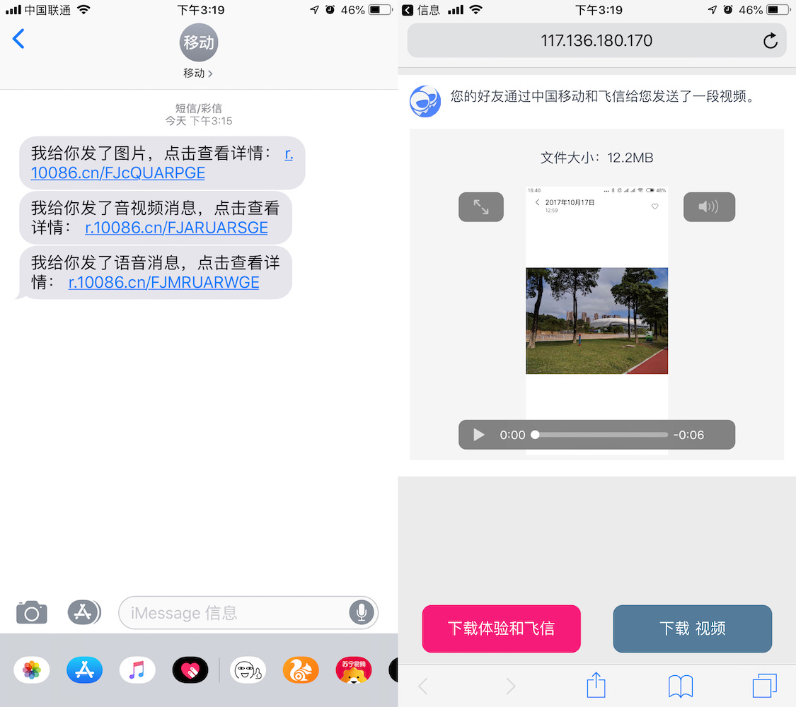
              * 注：移动发给其他的短信费用
                * 电信、联通等：0.01元/条
                * 国际（香港等）费用：1元/条
  * 支持传输方式
    * 数据网络
    * WIFI
  * 支持数据格式
    * 短信
    * 图片
    * 语音
    * 视频
    * 地理位置
    * VCard
    * 等
  * 其他模式
    * 建立群聊模式
      * 注：部分机型只支持1对1消息
  * 哪些手机卡可以使用？
    * 中国移动的4G卡/5G卡 都支持
      * 2G和3G卡 不支持

## 不同手机厂商对RCS增强短信的支持情况

* 已支持的手机厂商
  * 华为
    * EMUI 8.1+（部分8.0）
  * 小米
    * MIUI 10.1+
  * 三星
  * 魅族
    * Flyme 7.2.2+(及部分机型)
  * 海信
    * 合作机型：210系列 310系列 510系列700系列
    * 系统版本 >= `Android O`
* 实际效果：RCS短信在不同品牌机型上的名称各有不同
  * 华为
    * 短信输入框显示为：增强信息
      * 
  * 三星
    * 短信输入框显示为：输入框左下角有一个标识
      * 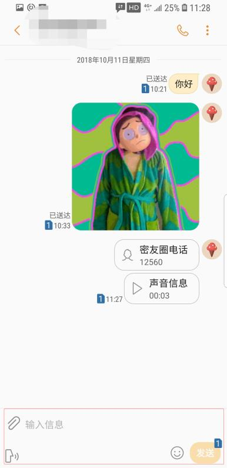
  * 小米
    * 旧：短信输入框显示为：移动网络短信
      * 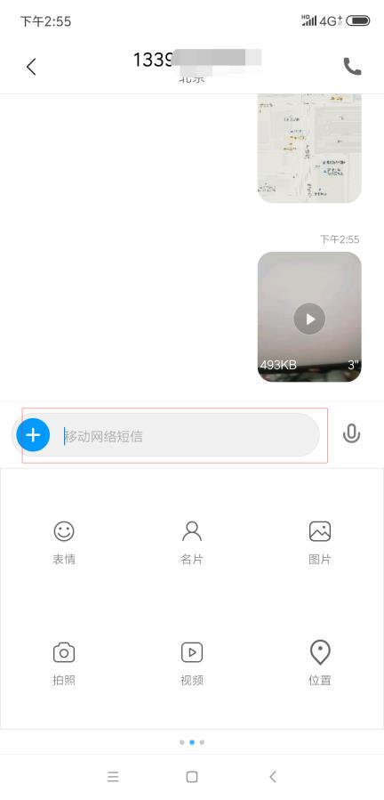
    * 新：短信输入框显示为：5G消息
      * 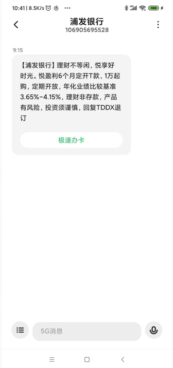
      * 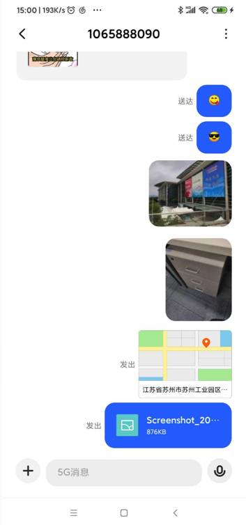
  * 魅族
    * 短信输入框显示为：智慧短信
      * 
  * 海信
    * 短信输入框显示为：即时消息
      * 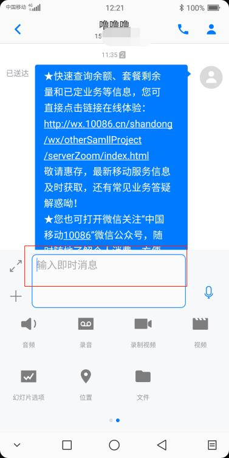
  * 360
    * 短信输入框显示为：网络消息
      * 
  * OPPO
    * 短信输入框显示为：中国移动网络短信
      * 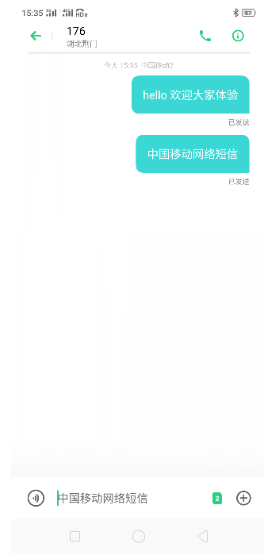
* 如何开启
  * 华为手机
    * 点击手机信息（短信）->更多->设置—>增强信息（开启/关闭）
      * 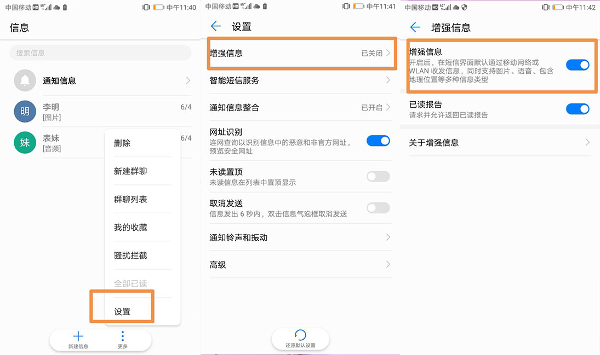
  * 小米手机
    * 点击手机信息（短信）->长按菜单键进入短信设置->移动网络短信（开启/关闭）
      * 最新已更新为：`5G消息`
        * 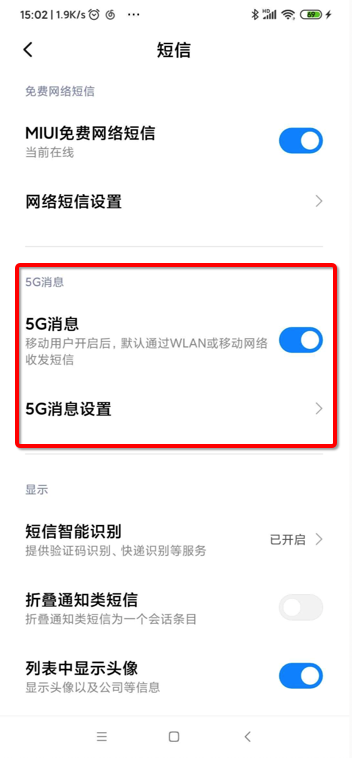
    * 全面屏手势用户开启路径：系统设置->系统应用—>短信—>移动网络短信->开启
      * 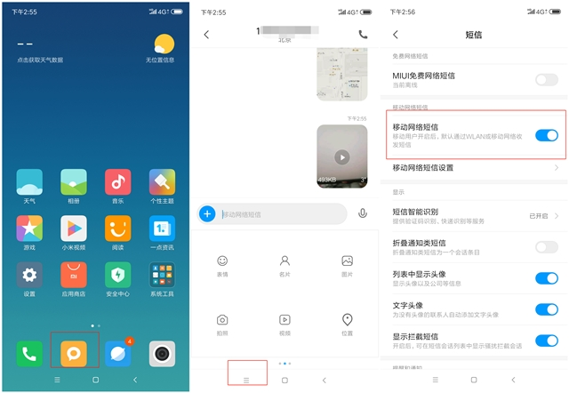
  * 魅族
    * 点击手机信息（短信）->右上角三个点->设置->智慧短信（开启/关闭）
  * 海信
    * 点击手机信息（短信）->设置->融合通信（开启/关闭）
  * 360
    * 点击手机信息（短信）->右上角三个点->短信设置->RCS设置（开启/关闭）
  * 三星
    * 点击手机信息（短信）->右上角三个点 ->设置->聊天设置->和飞信（开启/关闭）
  * OPPO
    * 点击手机信息信息->设置->中国移动网络短信(开启/关闭)
