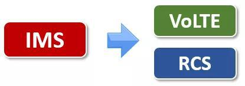
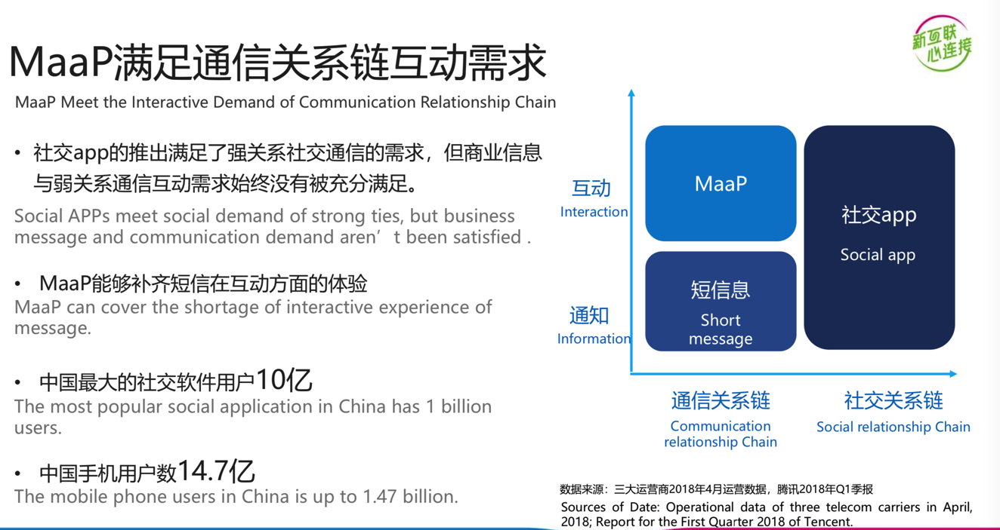

# RCS历史起源

* 最早：`3G`
  * 重点：数据业务
* 后来：`3G`到`4G`
  * `3GPP`组织
    * 传统短信+短信 -> 多媒体
    * 2002年，3GPP Release 5提出：`IMS`
  * `IMS`=`IP Multimedia Subsystem`=`IP多媒体子系统`
    * 作用
      * `IMS`就是`4G LTE`网络的一个“插件”
        * 帮助`4G LTE`这个纯数据网络，实现对语音通话和短信的支持，并对它们进行强化
          * 升级为多媒体形式
          * 有了它，`4G`才能**打电话**和**发短信**
    * 基本原理
      * 
    * 应用举例
      * 在`IMS`的基础上，才有了`VoLTE`和`RCS`
        * 
        * 换句话说：`VoLTE`=`Voice over LTE`基于IMS
  * 2007年
    * 一小部分`GSMA`成员提出`RCS`
      * 目的是为了运营商之间的多媒体消息互通
  * 2008年 成立`RCS`项目
      * 起名`home`
    * 之后发布多个版本
      * `RCS`
      * `RCS-e`：IP消息+Video share
        * e=enhance=增强型
  * 2008年 `4G LTE`
      * 运行商建设4G的标配带`RCS`
  * 2008年 前后
    * `iOS`和`安卓`问世
  * 2011年
    * `OTT`通讯工具 井喷
      * -》大量蚕食了传统运营商的语音、短信收入
        * 海外运营商更加仰仗`RCS`，希望借此与OTT软件进行竞争
          * `Vodafone`、`Orange`、`SKT`、`Verizon`、`O2`等海外知名运营商都推出了自己的RCS解决方案和品牌
  * 2016年
    * 目的：进一步推动`RCS`的产品开发及全球部署
    * GSMA推出：
      * `RCS`的`Universal Profile`=`UP`=`通用配置文件`
        * 目前最新的版本，就是2019年10月发布的`Version 2.4`
  * 2017年
    * GSMA在UP 2.0规范中
      * 引入了：`MaaP`
        * `MaaP`=`Messaging as a Platform`=`消息即平台`
      * 还发布了MaaP白皮书
      * 明确提出了面向`A2P`=`Application to Person`行业消息：`RCS商业富媒体消息`
        * 企业可以通过类似服务号的形式与用户互动，用户可以在RCS界面内实现**搜索**、**交互**、**购物**、**支付**等
    * MaaP 内的 RCS商业富媒体消息
      * 细节见后续 个人<->企业 的消息
  * 2018年
    * MaaP
      * MaaP满足通信关系链互动需求
        * 